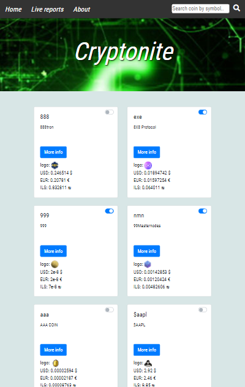
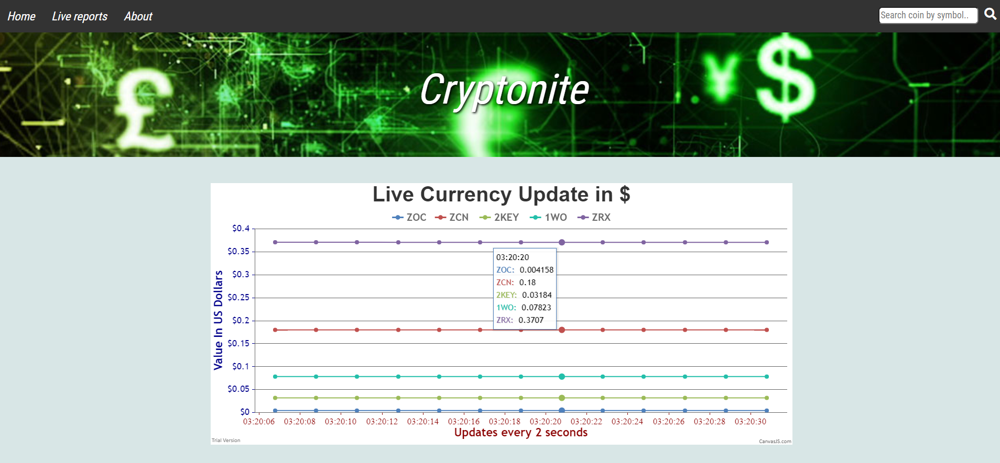
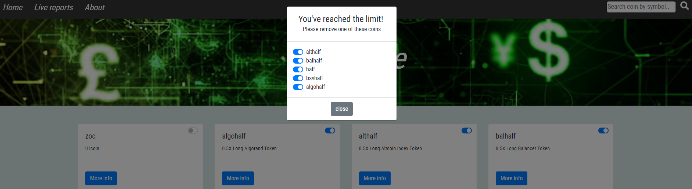
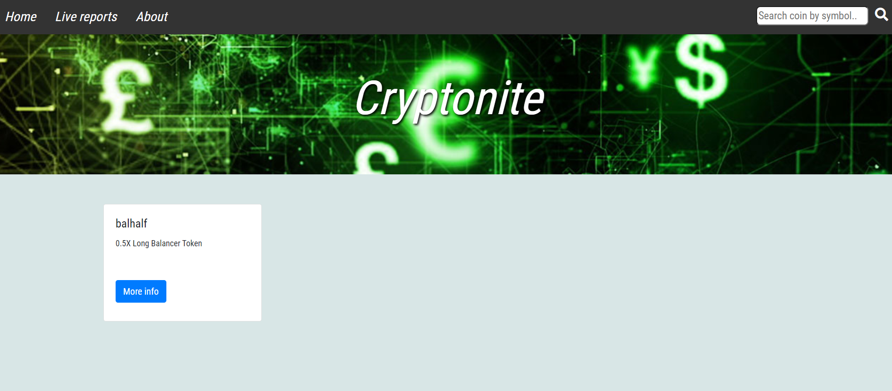

# CryptoCurrency_Tracker

CryptoCurrency Tracker SPA, which is based mainly on jQuery and Ajax (RESTful API).

## Topics:

* HTML + CSS
  - New HTML5 tags
  - CSS3 media queries and advanced selectors
  - Dynamic page layouts
  - Bootstrap & flex
* JavaScript
  - Objects
  - Callbacks, Promises, Async Await
  - jQuery
  - Single Page Application foundations
  - Events
  - Ajax (RESTful API)
  - CanvasJS
  - Documentation
* External API’s

 

### Main Page:

### Mobile Friendly:

### Live Reports:
* Shows the USD price of each selected coin, updates every two seconds

### Example of choosing coin restriction, up to five coins:

### A search Engine for finding a specific coin:

### General Description:

This web application consists of three divs(using DOM methods).
The first page is "Home page",where I display the coins on each Bootstrap card,
while the application is loading the coins are retrieved from an external server(using Ajax,IIFE),then cached in 
"coincache" cache.

Each card consists "More info" button which displays the prices of the coin and logo,
when pressed,using Collapsing effect,we're sending a request to a server acording to its id,when we have 
a response ,we create an object that only has 4 properties(logo,three prices).
This object is cached in another cache(MoreInfoCache),and every next click we retrieve from This cache(using array and its methods,Jquery ajax),and it 
updates every two minutes(using "forEach","splice" methods and "setTimeOut" function).

furthermore,there's a toggle on each card which is located at the top of the card,
his role is to allow the user to choose whether he wants the coin to be shown on the "Live Reports"
page or not(using array and his methods and Bootsrap to create them).
Horeover,there's a limitation of five coins to be displayed on the "Live Reports" page(using If condition and For loop),when
the user exceeds,a popup window(modal) will be displayed with the five chosen coins(using Bootstrap to create it),the
user's asked to remove one of them on account of the sixth coin that was chosen(using If condition).

The second part is called "Live Reports" where all the five coins that are chosen on "Home Page"
are associated with this page.
These coins are displayed on a graph(an object) that consists of two axises(the axis X represents the time and Y the coin's price) 
and each coin has a colored line(an object array) on the graph that represents him(each coin has his own color).
The purpose of this graph is to show the user the price of each coin in US dollars 
that are updated evey two seconds(using Ajax and arrays).

The last page is called "About" consists of my own details,project's description and
an image of myself(using Flexbox,HTML)
