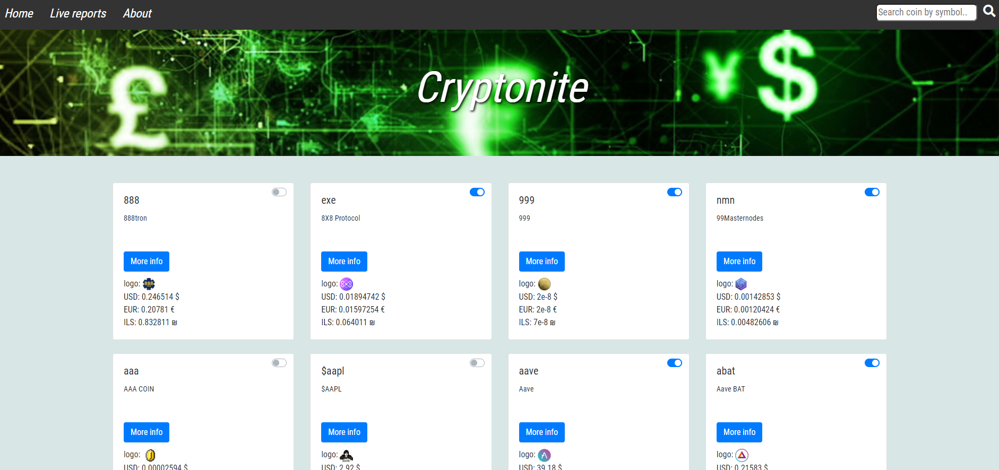

# CryptoCurrency Tracker

The project is a **client-side SPA (Single Page Application)** that presents information and reports from the world of virtual trading. The application makes calls to various **external APIs** that provide data about digital currencies, such as current status, real-time prices, trading history, buy/sell options, and more. All data is handled and stored entirely on the **client side**, with no need for a backend or database. The development leverages **HTML5**, **CSS3**, **JavaScript**, and **API integration**, focusing on delivering an interactive and dynamic user experience.
## Topics:

* HTML + CSS
  - New HTML5 tags
  - CSS3 media queries and advanced selectors
  - Dynamic page layouts
  - Bootstrap & flex
* JavaScript
  - Objects
  - Callbacks, Promises, Async Await
  - jQuery
  - Single Page Application foundations
  - Events
  - Ajax (RESTful API)
  - CanvasJS
  - Documentation
* External API’s

 

### Main Page:

### Mobile Friendly:

### Live Reports:
* Shows the USD price of each selected coin, updates every two seconds

### Example of choosing coin restriction, up to five coins:

### A search Engine for finding a specific coin:

